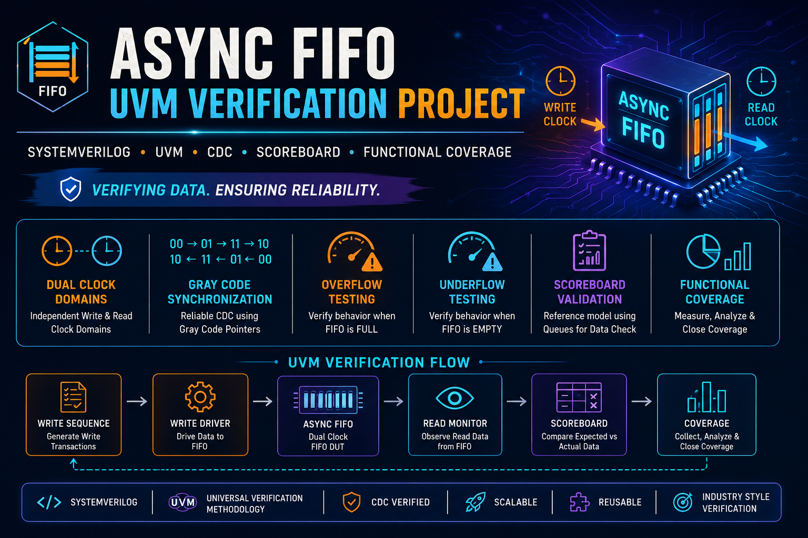

# 🚀 UVM Asynchronous FIFO Verification Project



## 📌 Project Overview

This project implements a complete UVM-based verification environment for an Asynchronous FIFO.

The FIFO operates between independent write and read clock domains, making verification significantly more challenging due to Clock Domain Crossing (CDC) behavior.

The verification environment validates:

- FIFO functionality
- Data integrity
- Overflow conditions
- Underflow conditions
- Concurrent read/write operations
- Full and Empty status behavior

using industry-standard UVM methodology.

---

## 🎯 Verification Objectives

✅ Verify FIFO Write Operations

✅ Verify FIFO Read Operations

✅ Verify Full Condition

✅ Verify Empty Condition

✅ Verify Overflow Handling

✅ Verify Underflow Handling

✅ Verify Concurrent Read & Write

✅ Verify Data Ordering

✅ Verify Data Integrity

✅ Functional Coverage Collection

---

## 🏗️ Verification Architecture

```text
                    +----------------+
                    |      TEST      |
                    +-------+--------+
                            |
                            v
                    +----------------+
                    |      ENV       |
                    +-------+--------+
                            |
          +-----------------+-----------------+
          |                                   |
          v                                   v
+-------------------+              +-------------------+
|    WRITE AGENT    |              |    READ AGENT     |
+---------+---------+              +---------+---------+
          |                                  |
          v                                  v
     +---------+                       +---------+
     | WR DRV  |                       | RD DRV  |
     +----+----+                       +----+----+
          |                                  |
          v                                  v

            +---------------------------+
            |       ASYNC FIFO DUT      |
            +---------------------------+

          ^                                  ^
          |                                  |
     +----+----+                       +----+----+
     | WR MON  |                       | RD MON  |
     +----+----+                       +----+----+
          |                                  |
          +--------------+-------------------+
                         |
                         v
                  +-------------+
                  | SCOREBOARD  |
                  +-------------+
```

---

## 📂 Project Structure

```text
FIFO_PROJECT/

├── async_design.v        # Asynchronous FIFO DUT
│
├── fifo_intf.sv          # Interface
├── fifo_common.sv        # Common Definitions
│
├── wr_tx.sv              # Write Transaction
├── wr_drv.sv             # Write Driver
├── wr_mon.sv             # Write Monitor
├── wr_sqr.sv             # Write Sequencer
├── wr_agent.sv           # Write Agent
│
├── rd_tx.sv             # Read Transaction
├── rd_drv.sv            # Read Driver
├── rd_mon.sv            # Read Monitor
├── rd_sqr.sv            # Read Sequencer
├── rd_agent.sv          # Read Agent
│
├── fifo_sbd.sv          # Scoreboard
├── wr_cov.sv            # Write Coverage
├── rd_cov.sv            # Read Coverage
│
├── env.sv               # Environment
├── base_test.sv         # Test Library
│
├── base_seq.sv
├── base_wr_seq.sv
├── base_rd_seq.sv
│
├── top.sv               # Top Module
├── run.do               # Simulation Script
└── list.svh             # Compilation File List
```

---

## 🧩 Key UVM Components

### 📦 Transactions

Write Transaction

- Write Enable
- Write Data

Read Transaction

- Read Enable
- Read Data

---

### 🚗 Drivers

Write Driver

- Drives FIFO write interface

Read Driver

- Drives FIFO read interface

---

### 👀 Monitors

Passively observe FIFO activity.

Collected transactions are broadcast through Analysis Ports.

---

### 🏢 Agents

Separate agents are implemented for:

- Write Domain
- Read Domain

This improves modularity and scalability.

---

### 📊 Scoreboard

Reference model implemented using queues.

```systemverilog
sbd_wq.push_back(wdata);
expected_data = sbd_wq.pop_front();
```

Responsibilities:

- FIFO order checking
- Data integrity verification
- Mismatch detection

---

## 🧪 Implemented Test Cases

### 1️⃣ Full FIFO Test

Verifies:

- FIFO reaches FULL state
- Additional writes handled correctly

---

### 2️⃣ Overflow Test

Verifies:

- Write attempts beyond capacity
- Overflow behavior

---

### 3️⃣ Empty FIFO Test

Verifies:

- FIFO reaches EMPTY state

---

### 4️⃣ Underflow Test

Verifies:

- Reads attempted on empty FIFO

---

### 5️⃣ Concurrent Read/Write Test

Verifies:

- Simultaneous FIFO activity
- Data consistency under load

---

## 🔍 Scoreboard Validation

Expected data is stored during write operations.

```systemverilog
sbd_wq.push_back(t1.wdata);
```

Read data is compared against expected values.

```systemverilog
expected_data = sbd_wq.pop_front();
```

Pass Criteria:

```text
Expected Data == Actual Data
```

---

## 📈 Functional Coverage

Coverage includes:

| Coverage Item | Purpose |
|--------------|----------|
| Write Operations | Verify write activity |
| Read Operations | Verify read activity |
| Full Condition | Verify FIFO saturation |
| Empty Condition | Verify FIFO depletion |
| Overflow | Verify invalid writes |
| Underflow | Verify invalid reads |
| Concurrent Activity | Verify simultaneous operations |

---

## ⚡ Asynchronous FIFO Concepts Verified

### Dual Clock Domains

- Independent Write Clock
- Independent Read Clock

### CDC Verification

- Safe data transfer
- Synchronizer behavior

### FIFO Ordering

- First In First Out property

### Data Integrity

- Correct data read back
- No corruption

---

## 🛠️ Tools Used

- SystemVerilog
- UVM
- ModelSim / QuestaSim

---

## 🌟 Verification Features

✅ Dual-Agent Architecture

✅ Independent Read & Write Domains

✅ Scoreboard-Based Checking

✅ Constrained Random Stimulus

✅ Functional Coverage

✅ Overflow Verification

✅ Underflow Verification

✅ Concurrent Transaction Verification

✅ Reusable UVM Architecture

---

## 📚 Learning Outcomes

This project demonstrates practical experience with:

- UVM Architecture
- Verification Planning
- CDC Verification
- FIFO Verification
- Scoreboards
- Analysis Ports
- Coverage Collection
- Constrained Random Verification
- Reusable Testbench Development

---

## 👨‍💻 Author

**Rakesh Magapu**

VLSI Design & Verification Engineer

SystemVerilog • UVM • RTL Verification • Functional Verification
